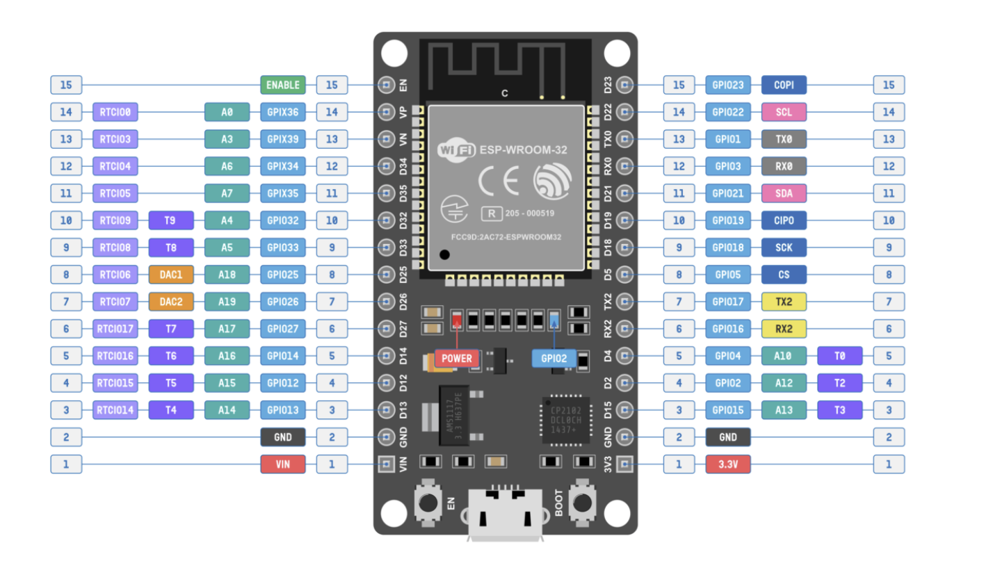
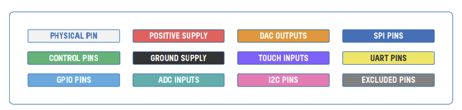
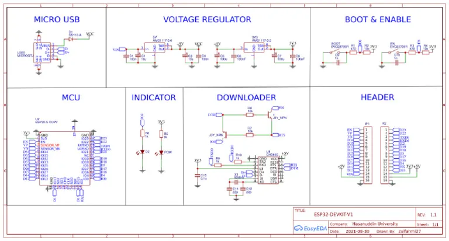
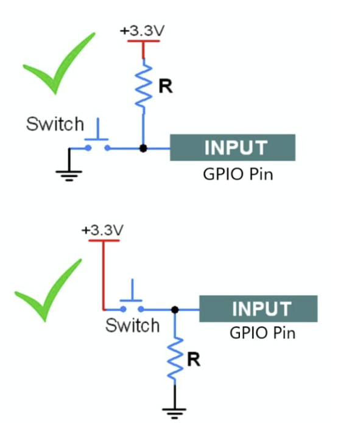
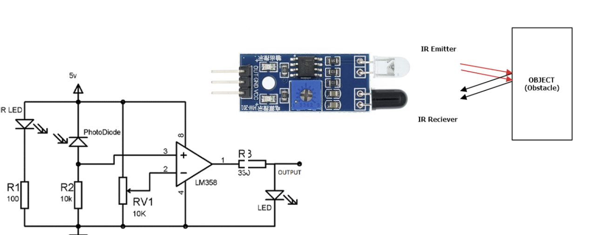
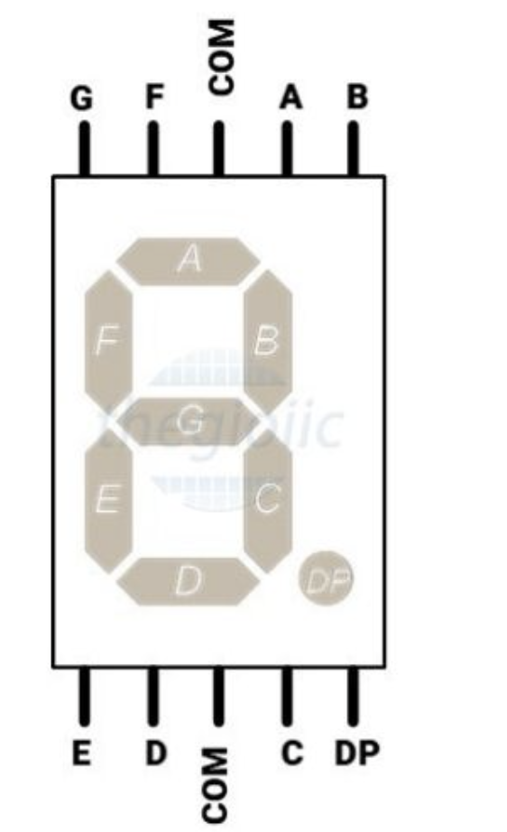
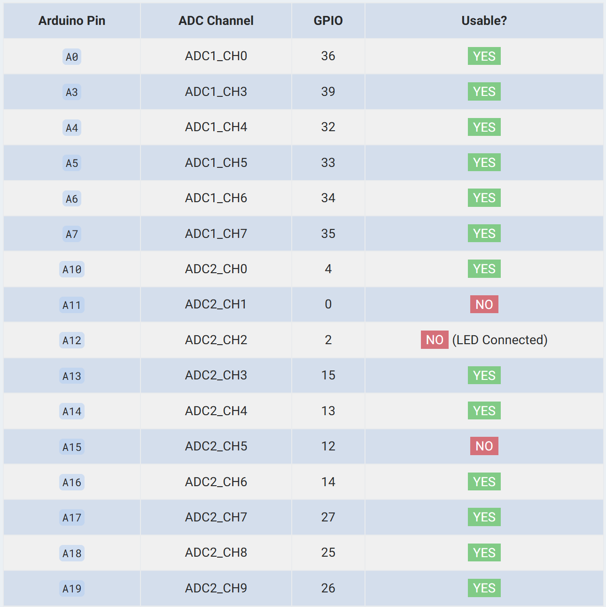

## TÀI LIỆU THAM KHẢO
----------------------------------------
Reference: 
https://www.espressif.com/sites/default/files/documentation/esp32_technical_reference_manual_en.pdf
Module: 
https://www.circuitstate.com/pinouts/doit-esp32-devkit-v1-wifi-development-board-pinout-diagram-and-reference/

----------------------------------------

## CHƯƠNG 00 HƯỚNG DẪN CÁCH HỌC
Đối với mọi con vi điều khiển mà các bạn muốn học
```cpp
- Đọc tài liệu nhà sản xuất (Biết thông tin cơ bản như SRAM, FLASH,..)
- Đọc example về ngoại vi nếu có (Cái này thì ESP32 làm rất tốt)
- Đọc reference của ngoại vi cần thiết
- Thực hành ngoại vi đó với các module IC(sensor) mình có sẵn
```

## CHƯƠNG 01 TẠO VÀ BUILD PROJECT
Module kit v1

Chức năng của các chân


Schematic


Các lệnh khởi tạo project
```cpp
- B1 vào shell/cmd idf
- B2 cd tới ổ chứa project
- B3 idf.py create-project NAME
- B4 cd vào NAME
- B5 idf.py set-target esp32
```
Các lệnh build và nạp
```cpp
- idf.py build               : build dự án
- idf.py -p COMx flash       : Nạp vào chip
- idf.py -p COMx monitor     : Mở monitor nhìn printf
```

Chương trình đầu tiên
```cpp
#include <stdio.h>
#include "freertos/FreeRTOS.h"
#include "freertos/task.h"
#include "driver/gpio.h"

void app_main(void)
{
    gpio_set_direction(2, GPIO_MODE_OUTPUT);

    while (1)
    {
        gpio_set_level(2, 1);
        vTaskDelay(1000 / portTICK_PERIOD_MS);
        gpio_set_level(2, 0);
        vTaskDelay(1000 / portTICK_PERIOD_MS);
    }
}

```

## CHƯƠNG 02 GPIO

### 2.1 Lý Thuyết

GPIO là General Purpose Input/Output
```
Là các chân tín hiệu trên vi điều khiển (MCU) có thể lập trình để làm ngõ vào (input) hoặc ngõ ra (output)
```
Cơ chế cơ bản của GPIO
```
Input:
Đọc tín hiệu từ bên ngoài (nút nhấn, sensor, tín hiệu logic).
Có thể bật pull-up hoặc pull-down nội bộ để định mức logic khi không có kết nối.

Output:
Xuất tín hiệu logic để điều khiển
Push-pull: xuất được cả mức HIGH và LOW.
Open-drain: chỉ kéo xuống LOW, mức HIGH cần điện trở kéo ngoài.

Alternate Function (chức năng thay thế):
GPIO có chức năng như: UART, SPI, I²C, PWM, ADC,…
```

Pull up và Pull down


Open drain và Push pull
```
Open drain: Có thể ở trạng thái: floating và 0
Push pull: Có thể ở trạng thái: 1 và 0
```

Cách config GPIO
#### Cách 01 - Tiện với config từng chân
Sử dụng 
```cpp
gpio_set_direction(number, mode);
```
#### Cách 02 - Có thể config nhiều chân cùng lúc
```cpp
    gpio_config_t io_conf = {
        .intr_type = GPIO_INTR_DISABLE,         // Disable interrupt
        .mode = GPIO_MODE_INPUT,                // Input
        .pin_bit_mask = (1ULL << GPIO_NUM_4),   // GPIO4
        .pull_down_en = GPIO_PULLDOWN_DISABLE,  // No pull-down
        .pull_up_en = GPIO_PULLUP_ENABLE,       // pull-up
    };
    gpio_config(&io_conf);
```
Trong đó
```cpp
typedef struct {
    uint64_t pin_bit_mask;          /*!< GPIO pin: set with bit mask, each bit maps to a GPIO */
    gpio_mode_t mode;               /*!< GPIO mode: set input/output mode                     */
    gpio_pullup_t pull_up_en;       /*!< GPIO pull-up                                         */
    gpio_pulldown_t pull_down_en;   /*!< GPIO pull-down                                       */
    gpio_int_type_t intr_type;      /*!< GPIO interrupt type                                  */
} gpio_config_t;
```
### 2.2 Các function cần chú ý
```cpp
gpio_get_level(num);        : Get ra mức của GPIO
gpio_set_level(num, state)  : Set trạng thái của GPIO
gpio_config(&io_conf);      : Set config GPIO
```
### 2.3 Thực hành với led 7 đoạn và IR Sensor
#### 2.3.1 IR Sensor


#### 2.3.2 Led 7 đoạn

```cpp
| Ký tự | a b c d e f g dp | Logical (bin) | Logical (hex) | Common-anode port                   |
| ----: | :--------------: | :-----------: | :-----------: | :---------------------------------: |
|     0 |  1 1 1 1 1 1 0 0 |  `0b00111111` |     `0x3F`    |            `~0x3F = 0xC0`           |
|     1 |  0 1 1 0 0 0 0 0 |  `0b00000110` |     `0x06`    |                `0xF9`               |
|     2 |  1 1 0 1 1 0 1 0 |  `0b01011011` |     `0x5B`    |                `0xA4`               |
|     3 |  1 1 1 1 0 0 1 0 |  `0b01001111` |     `0x4F`    |                `0xB0`               |
|     4 |  0 1 1 0 0 1 1 0 |  `0b01100110` |     `0x66`    |                `0x99`               |
|     5 |  1 0 1 1 0 1 1 0 |  `0b01101101` |     `0x6D`    |                `0x92`               |
|     6 |  1 0 1 1 1 1 1 0 |  `0b01111101` |     `0x7D`    |                `0x82`               |
|     7 |  1 1 1 0 0 0 0 0 |  `0b00000111` |     `0x07`    |                `0xF8`               |
|     8 |  1 1 1 1 1 1 1 0 |  `0b01111111` |     `0x7F`    |                `0x80`               |
|     9 |  1 1 1 1 0 1 1 0 |  `0b01101111` |     `0x6F`    |                `0x90`               |
|     A |  1 1 1 0 1 1 1 0 |  `0b01110111` |     `0x77`    |                `0x88`               |
|     b |  0 0 1 1 1 1 1 0 |  `0b01111100` |     `0x7C`    |                `0x83`               |
|     C |  1 0 0 1 1 1 0 0 |  `0b00111001` |     `0x39`    |                `0xC6`               |
|     d |  0 1 1 1 1 0 1 0 |  `0b01011110` |     `0x5E`    |                `0xA1`               |
|     E |  1 0 0 1 1 1 1 0 |  `0b01111001` |     `0x79`    |                `0x86`               |
|     F |  1 0 0 0 1 1 1 0 |  `0b01110001` |     `0x71`    |                `0x8E`               |
```
```cpp
#include "freertos/FreeRTOS.h"
#include "freertos/task.h"
#include "driver/gpio.h"

#define NUM_SEGMENTS 7
int seg_pins[NUM_SEGMENTS] = {2, 4, 5, 18, 19, 21, 22};  // a,b,c,d,e,f,g

//(cathode chung)
const uint8_t seg_code[10] = {
    0x3F, // 0
    0x06, // 1
    0x5B, // 2
    0x4F, // 3
    0x66, // 4
    0x6D, // 5
    0x7D, // 6
    0x07, // 7
    0x7F, // 8
    0x6F  // 9
};

void display_digit(uint8_t num) {
    // Đảo bit vì Anode chung sáng khi mức LOW
    uint8_t code = ~seg_code[num];

    for (int i = 0; i < NUM_SEGMENTS; i++) {
        int state = (code >> i) & 0x01;
        gpio_set_level(seg_pins[i], state);
    }
}

void app_main(void) {
    for (int i = 0; i < NUM_SEGMENTS; i++) {
        gpio_reset_pin(seg_pins[i]);
        gpio_set_direction(seg_pins[i], GPIO_MODE_OUTPUT);   // Hoặc dùng configGPIO như mình hướng dẫn trong video
    }

    while (1) {
        for (int i = 0; i < 10; i++) {
            display_digit(i);
            vTaskDelay(pdMS_TO_TICKS(1000));
        }
    }
}

```

Cách config thư viện
```
idf_component_register(SRCS "led7.c"
                      INCLUDE_DIRS ".")
```
Trong main make
```
idf_component_register(SRCS "BlinkLed.c"
                    INCLUDE_DIRS "." 
                    REQUIRES driver led)
```

## CHƯƠNG 03 ADC
### 3.1 Lý thuyết

Gồm 2 bộ ADC độc lập (ADC1 và ADC2)
```
ADC1: 8 chanels
ADC2: 10 chanels
```
Độ phân giải ADC
```
Tối đa 12-bit (0–4095)
```
### 3.2 Thực chiến ADC
Sử dụng ADC1 CHANEL 0
Các bước làm
```cpp
    BƯỚC 1: Tạo handle cho ADC1 (Init)
    --------------------------------------------------------
    adc_oneshot_unit_handle_t adc1_handle;
    adc_oneshot_unit_init_cfg_t init_config = {
        .unit_id = ADC_UNIT_1,
    };
    adc_oneshot_new_unit(&init_config, &adc1_handle);

    BƯỚC 2: Cấu hình chanel ADC1 - CH0
    --------------------------------------------------------
    adc_oneshot_chan_cfg_t config = {
        .bitwidth = ADC_BITWIDTH_DEFAULT,   // Default là 12 bits
        .atten = ADC_ATTEN_DB_12,           // 12db cho phép đọc tới ~3.3V
    };
    adc_oneshot_config_channel(adc1_handle, ADC_CHANNEL_0, &config);
    
    BƯỚC 3: Đọc ADC (Hiệu chuẩn bằng Calibration nếu cần)
    ---------------------------------------------------------
    adc_oneshot_read(adc1_handle, ADC_CHANNEL_0, &value);
    printf("ADC1_CH0 (GPIO36) value: %d\n", value);
```
Example
```cpp
#include <stdio.h>
#include "esp_adc/adc_oneshot.h"
#include "freertos/FreeRTOS.h"
#include "freertos/task.h"

void app_main(void)
{

    adc_oneshot_unit_handle_t adc1_handle;
    adc_oneshot_unit_init_cfg_t init_config = {
        .unit_id = ADC_UNIT_1,
    };
    adc_oneshot_new_unit(&init_config, &adc1_handle);

    adc_oneshot_chan_cfg_t config = {
        .bitwidth = ADC_BITWIDTH_DEFAULT, 
        .atten = ADC_ATTEN_DB_12,         
    };
    adc_oneshot_config_channel(adc1_handle, ADC_CHANNEL_0, &config);

    int value;
    while (1)
    {
        adc_oneshot_read(adc1_handle, ADC_CHANNEL_0, &value);
        printf("ADC1_CH0 (GPIO36) value: %d\n", value);
        vTaskDelay(pdMS_TO_TICKS(1000));
    }
}
```
## CHƯƠNG 04 TIMER - PWM
Example
```cpp
#include <stdio.h>
#include "driver/ledc.h"
#include "freertos/FreeRTOS.h"
#include "freertos/task.h"

#define LED_PIN         2             
#define LEDC_TIMER      LEDC_TIMER_0
#define LEDC_CHANNEL    LEDC_CHANNEL_0
#define LEDC_MODE       LEDC_LOW_SPEED_MODE
#define LEDC_DUTY_RES   LEDC_TIMER_8_BIT  
#define LEDC_FREQUENCY  5000          

void app_main(void)
{
  
    ledc_timer_config_t ledc_timer = {
        .speed_mode       = LEDC_MODE,
        .timer_num        = LEDC_TIMER,
        .duty_resolution  = LEDC_DUTY_RES,
        .freq_hz          = LEDC_FREQUENCY,
        .clk_cfg          = LEDC_AUTO_CLK
    };
    ledc_timer_config(&ledc_timer);

    
    ledc_channel_config_t ledc_channel = {
        .speed_mode     = LEDC_MODE,
        .channel        = LEDC_CHANNEL,
        .timer_sel      = LEDC_TIMER,
        .intr_type      = LEDC_INTR_DISABLE,
        .gpio_num       = LED_PIN,
        .duty           = 0,
        .hpoint         = 0
    };
    ledc_channel_config(&ledc_channel);


    while (1)
    {

        for (int duty = 0; duty <= 255; duty++)
        {
            ledc_set_duty(LEDC_MODE, LEDC_CHANNEL, duty);
            ledc_update_duty(LEDC_MODE, LEDC_CHANNEL);
            vTaskDelay(pdMS_TO_TICKS(10));  
        }

        for (int duty = 255; duty >= 0; duty--)
        {
            ledc_set_duty(LEDC_MODE, LEDC_CHANNEL, duty);
            ledc_update_duty(LEDC_MODE, LEDC_CHANNEL);
            vTaskDelay(pdMS_TO_TICKS(10));
        }
    }
}

```

Bản chất của các struct ledc_timer_config_t

| Thành phần          | Kiểu dữ liệu       | Ví dụ                 | Ý nghĩa                                                                        |
| ------------------- | ------------------ | --------------------- | ------------------------------------------------------------------------------ |
| **speed_mode**      | `ledc_mode_t`      | `LEDC_LOW_SPEED_MODE` | Chọn **LOW_SPEED_MODE** hoặc **HIGH_SPEED_MODE**.                              |
| **timer_num**       | `ledc_timer_t`     | `LEDC_TIMER_0`        | Chọn bộ timer nào (0 → 3)                                                      |
| **duty_resolution** | `ledc_timer_bit_t` | `LEDC_TIMER_8_BIT`    | Độ phân giải PWM (1 → 16 bit)                                                  |
| **freq_hz**         | `uint32_t`         | `5000`                | Tần số PWM (Hz)                                                                |
| **clk_cfg**         | `ledc_clk_cfg_t`   | `LEDC_AUTO_CLK`       | Chọn nguồn clock: `LEDC_USE_APB_CLK`, `LEDC_USE_REF_TICK`, hoặc `LEDC_AUTO_CLK`|
| **deconfigure**     | `uint32_t`         | (ít dùng)             | Xóa cấu hình timer cũ (nếu cần reset cấu hình)                                 |


## CHƯƠNG 05 UART

## CHƯƠNG 06 I2C

## CHƯƠNG 07 SPI

## CHƯƠNG 08 I2S

## CHƯƠNG 09 WIFI

## CHƯƠNG 10 BLUETOOTH

